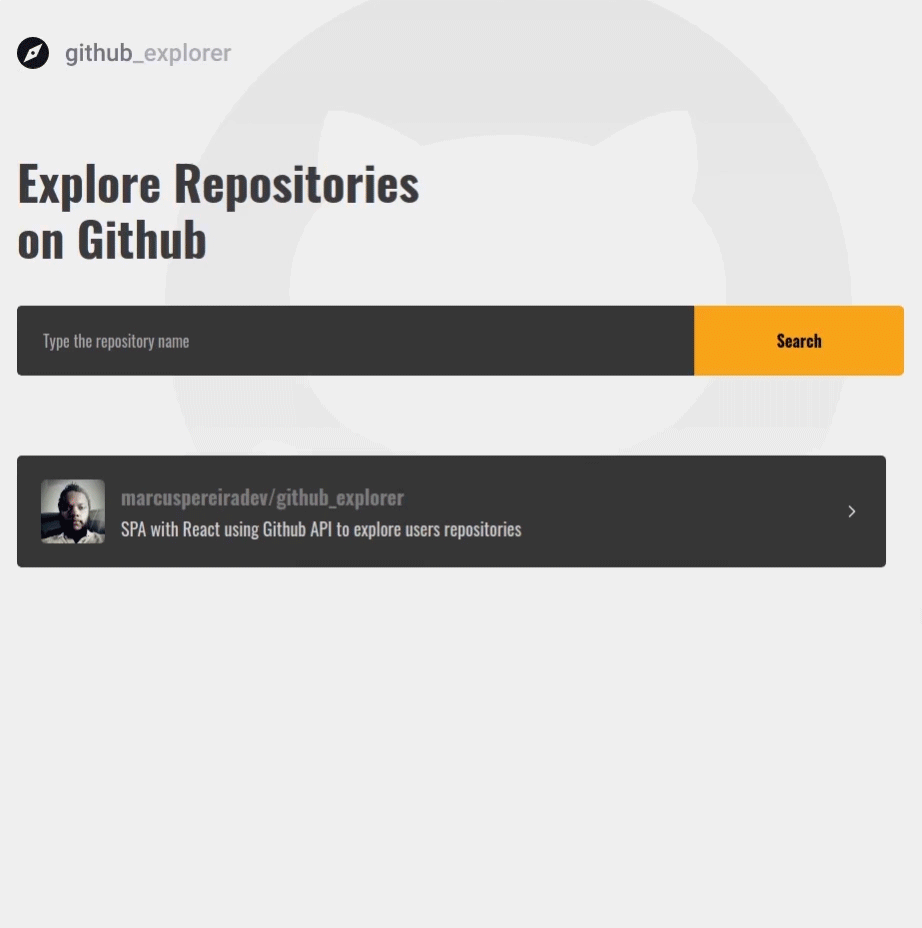
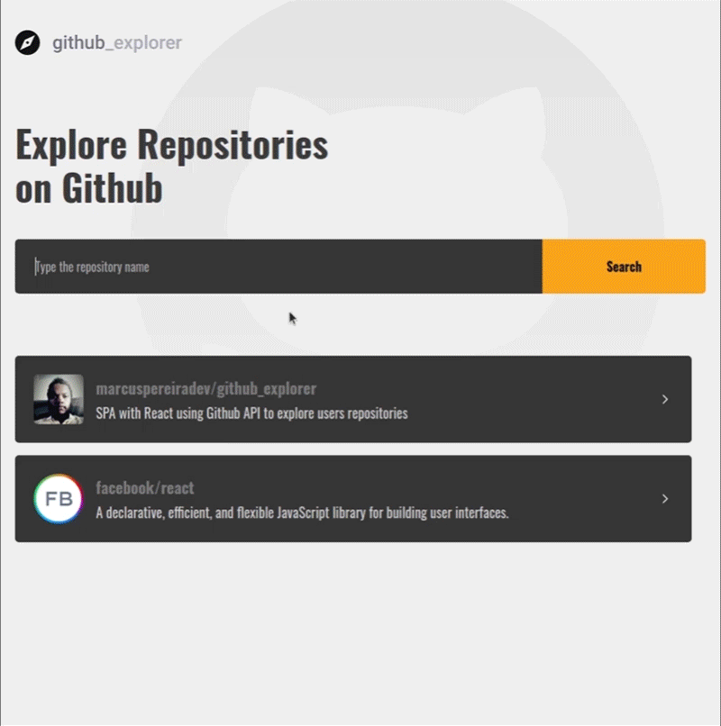
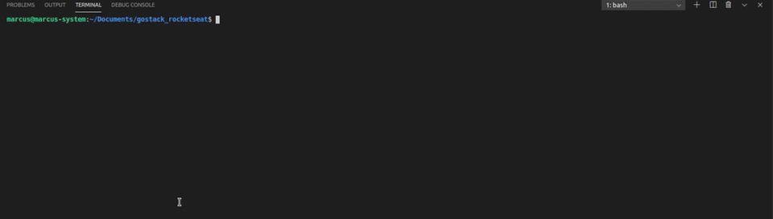
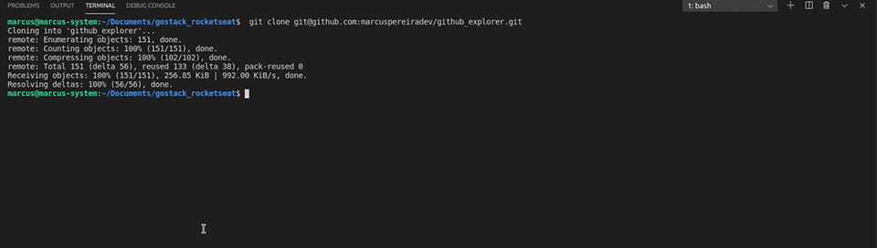
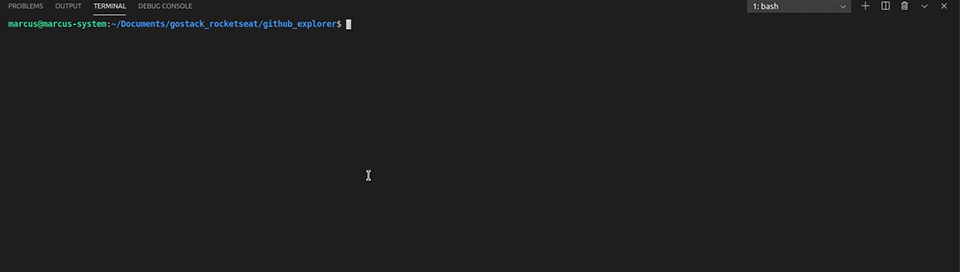

<br />
<p align="center">
  <a>
    
  </a>
</p>

<p align="center">
  Explore Github Repositories. Builting with ReactJS and Styled Components.
</p>

<br />

## Features

<p align="center">
  
</p>

<br />

<p align="center">
  
</p>

<br />

## Installation

You may clone this repository

```
  git clone git@github.com:marcuspereiradev/github_explorer.git
```

<p align="center">
  
</p>

<br />

Inside the created directory run the scripts in order to execute the application.

```
  // Install the dependencies
  yarn install
```

<p align="center">
  
</p>

<br />

```
  // Start the application
  yarn start
```

<p align="center">
  
</p>


## Authors

|  [Marcus Pereira](https://github.com/marcuspereiradev)   |
